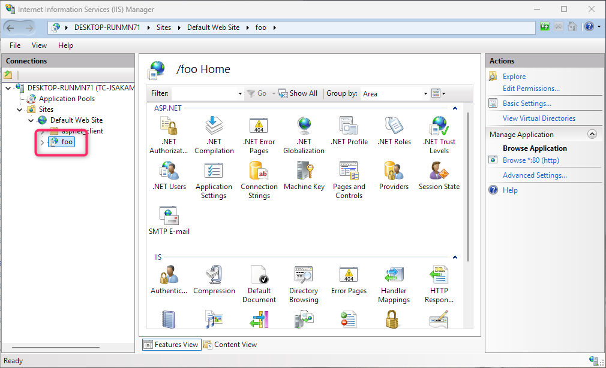

# 🗂️ Configure path base

## Blazing Story WebAssembly App

To configure the path base for your Blazing Story WebAssembly app, you need to update the `href` property of the `<base />` element in both the `wwwroot/index.html` and `wwwroot/iframe.html` files. This property determines the base URL for your application.

Here's an example of how to set the path base:

```html
<base href="/my-app/" />
```

In this example, the path base is set to `/my-app/`. This means that all relative URLs in your application will be resolved against this base URL.

Make sure to adjust the path base according to your application's deployment structure.

## Blazing Story Server App

### Deploying to subdirectories in IIS as a virtual application

If you are deploying your Blazing Story Server app as a virtual application in IIS, **you don't need to do anything special** to configure the path base. IIS and the ASP.NET Core module automatically handle the path base for virtual applications, and your application will work correctly in any subdirectory without any additional configuration. However, ensure that your application is correctly configured to run as a virtual application in IIS.




### Changing the path base of the Blazing Story App component

To change the path base of the Blazing Story Server Application component (not the entire application URL), you can use the `IApplicationBuilder.Map(string pathMatch, Func<IApplicationBuilder> configuration)` method in the `Program.cs` file of your Blazing Story Server app. Here's an example:

```cs
app.Map("/stories", appBuilder =>
{
    appBuilder.UseRouting();
    appBuilder.UseAntiforgery();
    appBuilder.UseEndpoints(endpoints =>
    {
        endpoints.MapStaticFiles(); // If you are using .NET 8, use "appBuilder.UseStaticFiles();" instead.
        endpoints.MapRazorComponents<BlazingStoryServerComponent<IndexPage, IFramePage>>()
            .AddInteractiveServerRenderMode();
    });
});
```

In this example, the Blazing Story Server Application component is mapped to the `/stories` path. This means that the Blazing Story App component will be accessible at `http://<your-domain>/stories`, while the rest of your application can still be accessed at the root URL or other paths as needed. If you add the following code after the code above, a Blazor Server application based on the `DefaultApp.razor` application component will work under the root URL:

```cs
app.UseRouting();
app.UseAntiforgery();
#pragma warning disable ASP0014
app.UseEndpoints(endpoints =>
{
    endpoints.MapStaticFiles(); // If you are using .NET 8, use "appBuilder.UseStaticFiles();" instead.
    endpoints.MapRazorComponents<DefaultApp>()
        .AddInteractiveServerRenderMode();
});
#pragma warning restore ASP0014
```

The result will be a single Blazing Story Server application hosting multiple Blazor Server applications, each under different path bases. The following GIF shows an example of such an application:


You can get the complete source code for the sample above from the following URL:

- https://github.com/sample-by-jsakamoto/BlazingStory-PathBase