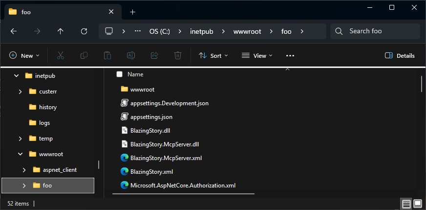

# 🗂️ Configure path base

## Blazing Story WebAssembly App

To configure the path base for your Blazing Story WebAssembly App, you need to update the `href` property of the `<base />` element in both the `wwwroot/index.html` and `wwwroot/iframe.html` files. This property determines the base URL for your application.

Here's an example of how to set the path base:

```html
<base href="/foo/" />
```

In this example, the path base is set to `/foo/`. This means that all relative URLs in your application will be resolved against this base URL.

Make sure to adjust the path base according to your application's deployment structure.

## Blazing Story Server App

### Deploying to subdirectories in IIS as a virtual application

If you are deploying your Blazing Story Server App as a virtual application in IIS, **you don't need to do anything special** to configure the path base. IIS and the ASP.NET Core module automatically handle the path base for virtual applications, and your application will work correctly in any subdirectory without any additional configuration. However, ensure that your application is correctly configured to run as a virtual application in IIS.





### Deploying behind a reverse proxy (nginx, etc.)

If you want to deploy your Blazing Story Server App behind a reverse proxy (such as nginx, Apache, or others) under a subpath, you need to configure both the reverse proxy and the Blazing Story Server App.

#### Configure the reverse proxy

Configure your reverse proxy to forward requests from the target subpath to the Blazing Story Server App. **The key point is to not rewrite the URL** when forwarding the request.

Here's an example nginx configuration (`nginx.conf`):

```nginx
...
http {
    ...
    upstream blazor_backend {
        # Specify the Blazing Story Server app running in the same host.
        server 127.0.0.1:5000;
    }

    server {
        listen 80;
        server_name localhost;

        # Mount Blazor app under /foo path, without URL rewriting.
        location /foo {
            proxy_pass http://blazor_backend;
            ...
        }
    }
}
```

#### Configure the Blazing Story Server App

On the Blazing Story Server App side, you need to configure the `UsePathBase` middleware in the `Program.cs` file to handle requests to the target subpath appropriately:

```cs
...
app.UseHttpsRedirection();

app.UsePathBase("/foo"); // Add this line

app.MapBlazingStoryMcp();
app.MapStaticAssets();
app.UseRouting();
app.UseAntiforgery();
app.MapRazorComponents<BlazingStoryServerComponent<IndexPage, IFramePage>>()
    .AddInteractiveServerRenderMode();

app.Run();
```

With this combination of reverse proxy configuration and `UsePathBase` middleware, your Blazing Story Server App will work correctly under the specified subpath.

You can find a complete working example using nginx as a reverse proxy in the following GitHub repository:

- https://github.com/BlazingStory/samples/tree/main/pathbase/nginx

### Changing the path base of the Blazing Story App component

To change the path base of the Blazing Story Server App component (not the entire application URL), you can use the `IApplicationBuilder.Map(string pathMatch, Func<IApplicationBuilder> configuration)` method in the `Program.cs` file of your Blazing Story Server App. Here's an example:

```cs
app.Map("/stories", appBuilder =>
{
    appBuilder.UseRouting();
    appBuilder.UseAntiforgery();
    appBuilder.UseEndpoints(endpoints =>
    {
        endpoints.MapStaticFiles(); // If you are using .NET 8, use "appBuilder.UseStaticFiles();" instead.
        endpoints.MapRazorComponents<BlazingStoryServerComponent<IndexPage, IFramePage>>()
            .AddInteractiveServerRenderMode();
    });
});
```

In this example, the Blazing Story Server App component is mapped to the `/stories` path. This means that the Blazing Story App component will be accessible at `http://<your-domain>/stories`, while the rest of your application can still be accessed at the root URL or other paths as needed. If you add the following code after the code above, a Blazor Server App based on the `DefaultApp.razor` application component will work under the root URL:

```cs
app.UseRouting();
app.UseAntiforgery();
#pragma warning disable ASP0014
app.UseEndpoints(endpoints =>
{
    endpoints.MapStaticFiles(); // If you are using .NET 8, use "appBuilder.UseStaticFiles();" instead.
    endpoints.MapRazorComponents<DefaultApp>()
        .AddInteractiveServerRenderMode();
});
#pragma warning restore ASP0014
```

The result will be a single Blazing Story Server App hosting multiple Blazor Server Apps, each under different path bases. The following GIF shows an example of such an application:


You can get the complete source code for the sample above from the following URL:

- https://github.com/BlazingStory/samples/tree/main/pathbase/multi-branches